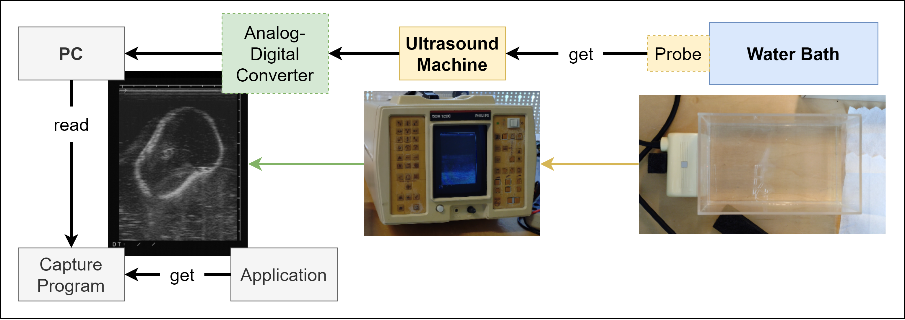
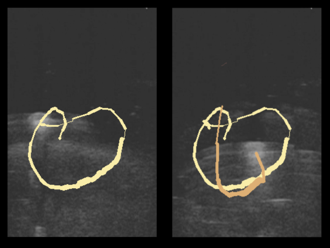
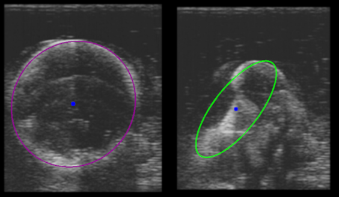
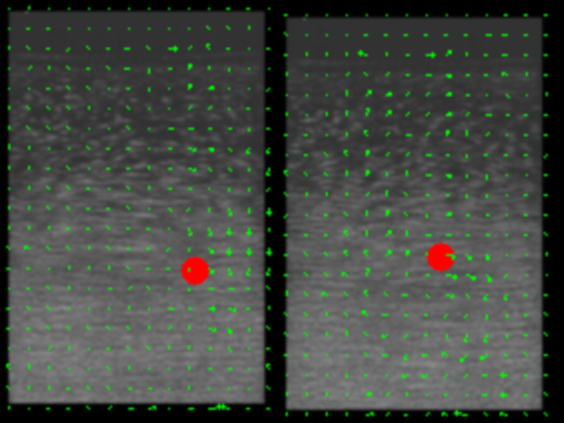
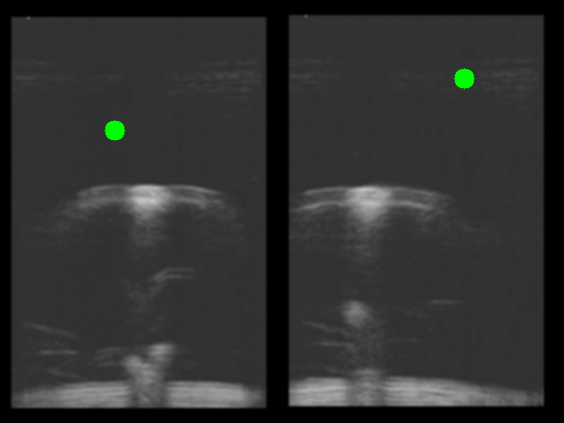

# DEMOS
- different Demos to show use cases of Ultrasound imaging in HCI
- demos are build to work with provided Data
- detection parameters can easily be adapted to fit different videos (TODO)

## Usage

### Setup

**1st Option**: run the demos with the provided videos. Requires no additional setup.

**2nd Option**: run the demos with your own ultrasound videos:
  - drop your ultrasound videos in the `Data`-folder
  - this will require updating some of the demo-specific parameters

**3rd Option**: run the demo in a live setting:
  - see [live usage](#live-usage) section
  - Good Luck!

### Run the Demos

Clone the repository, create a .venv and install the requirements inside it. Then navigate to the `Demos`-Folder
```sh
git clone https://github.com/no-ls/MT_USInteraction.git

py -m venv .venv
.venv/Scripts/activate

py -m pip install -r requirements.txt

cd Demos
```


From there you can **run the demos** using the provided videos or by using a live stream from a virtual camera
```sh
py demo-name.py
```
or run them using your **own** videos
```sh
py demo-name.py -src path/to/video.mp4
```

### Controls
All demos use the same basic structure for playing and interacting with the footage (see: `Helpers`-Folder). Application-specific controls are marked as such:

|Key|Function|Application|
|:-:|:-------|----------:|
|<kbd>s</kbd>|save a screenshot of the current running demo in the `Data/Out`-Folder|all|
|<kbd>d</kbd>|toggle debug information|all|
|<kbd>↓↑</kbd>|adjust the segmentation parameters (threshold or color quantization), or use the slider|all|
|<kbd>r</kbd>|reset the application|all but scanner.py|
|<kbd>Enter</kbd>|start/stop a 3D scan (only works when OpenCV window is focused)|scanner.py|
|<kbd>f</kbd>|Toggle freehand-scan mode (still requires start/stop-ing scan)|scanner.py|


### Live Usage

#### Required equipment
1. Ultrasound machine, with video output
2. Capture Device (Analoge to Digital) with driver (e.g. Easy Cap)
3. Capture software (e.g. OBS Studio) or similar
4. Acrylic tank filled with water
5. Ultrasound gel

I used the *Philips Sono Diagnost R-1200* (SDR-1200) with the *LA 3510* probe (3.5 MHz). It has a lateral resolution (aka how far apart objects can be placed next to each other) or 1.6mm. A full view field of: 102x180 mm for the x1 zoom setting. Mostly I used the default x1.5 setting with 102x138mm. The machine returned 24.4 fps (1 focus point), 10.4 fps (2 focus points) or 5.1 fps (3 focus points, I never used that many). You'd likely also want to only use 1 or 2 focus point to not degrade performance too much, specifically for optical flow only 1 focus point is optimal.



#### Workflow
- Fill the acrylic tank with water and place the ultrasound probe against the side of it (use ultrasound gel as a coupling agent)
- Get the video output of the ultrasound machine with a capture device
- Capture with OBS
  - Set the video to PAL_B
  - Start a virtual camera
- Start the demos in python
  - Might have to change the `VIDEO_ID` in `Player.py` to match the virtual camera. Currently set to 2 

## Demo Overview
<!-- Goals:
- create demos that show off different abilities of ultrasound imaging
- create demos to extend the usage of ultrasound imaging into HCI -->
<!-- Top-Level explanation of Demos (why, what, how) -->
<!-- "Nav" to the detailed README's + short summary + image -->
<!-- Explain choices of detection method(s): why, how, expansion options, ... -->

### 1. 3D Scanner
- `scanner.py`
demo for: acoustic properties of different materials
- detect an object and recreate its cross section in 3D
- move the object to gather and append the cross sections
- use a reference point to estimate the position
- TODO

### 2. Painter
demo for: depth values
- `painter.py`

Use a finger to draw lines into the water bath. The application detects the contour and uses its center movement to draw lines. The size of the contour determines the line thickness. A line break (and color change) is caused when no significant contour can be detected (aka by removing your finger).

Uses a simple threshold to segment the contours. Adjust to your needs.



### 3. Deformable Interaction
- `deformer.py`

Demonstrates the use of a deformable material for interaction. Requires a stressball or similarly squishy material (tested with stress ball made out of TPE, anything else might require adjustments). Uses color quantization to segment the contour of the stressball from the background. Fits an ellipsis around the contour to get its major and minor axis, and use them to differentiate between squish and squash actions. They mimic right and left mouse clicks, respectively.
The center of the balls contour is used to simulate mouse movement.



### 4. Water Flow
- `flow.py`

Uses air bubbles introduced to the water from movement to track the motion of the water flow. These bubbles are segmented using an adaptive threshold and the processed frames are used for optical flow calculation. 
A ball is drawn over the frames, and the flow vectors are used to move it along the screen.




### 5. Reflection Visualization aka "Pong"
- `pong.py`

Visualizes the way a single ultrasound reflection works by creating a pong-style game. A ball (the reflection) moves down the screen. If it comes into contract with a strong enough reflector (e.g. your finger), its reflected. 
Score points by reflecting the ball back up the screen.

The segmentation is done using color quantization and uses the incident path, recreates the reflecting line (using the segmented contour), and then calculates the new reflection path.




## Detection_Suite
A quick and dirty setup for testing several different segmentation methods.

Run `py main.py` and then use the number key to navigate between the different methods. Save with `s` and toggle debug info with `d`.

<!-- Optical flow:
LOG:
Tutorial: https://docs.opencv.org/3.4/d4/dee/tutorial_optical_flow.html
    - finding brightest spot works, but not very consistently -> keeps changing
    - using FlowFarnback for dense optical flow works, but has similar issues
        -> tracking stays around an area, and doesn't move like the bubbles do
        -> Richtung lässt sich aber erahnen
    - TODO try preprocessing
    -> Try with better data -> faster motion, more bubbles, etc.
/W DENSE
    - bubbles not very reliable to find direction specifically angle
    - problem is that the magnitudes keeps changing (i.e biggest mag. not at the same spot)
    - no real motion is being detected (when drawing vectors), sometime half of a circular motion
    - an Ecken öfters "wirbel", manchmal auch in der Mitte, aber eher sporadisch
/W LK
    - init with single bubble -> pretty much stays in the same spot afterwards
    - init with color quantized image => only a little better
PROBLEMS:
    - Images too bad -> bubbles are not getting tracked properly
    - different brightness levels: higher = darker, lower = brighter -> tracking gets lost
    - Bubbles are not circular :( -> so prob. no hough circles
SUBTRACT BACKGROUND
    - bubbles are more visible
    - but does not seem to change much for optical flow
        - LK on contour -> does not find any good points
        - LK (normal) -> couldn't get it to work
        - Dense => looks very similar to the one without SB
==> Feature too small/too bad to work with regular optical flow
    - try to enhance features -> isolate + make "bigger"
        - rm background kinda works (but OF doesnt really get better)
        - morph operation don't do that much either
            - dilate => blasen werden zu groß -> Überlappungen
        - I DON'T KNOW, man...
    - try PIV Techniques
        - funktioniert auch nicht so viel besser
ADAPTIVE THRESHOLD
    - downsampling helps, when you don't upsample before the optical flow
    - regular blurring does not help as much as downsampling + morph op does
    - kann keine Unterschied zw. Gaussian und Mean C sehen
    - better than regular one
    - even better when paired with downsampling (pyrdown) + morph op (closeing) + upsampling before optical flow
    - Bewegungen immer noch eher sporadisch,
    - OTSU -> just removes basically everything
is framerate the issue ?? -> CUDA benutzen
""" -->